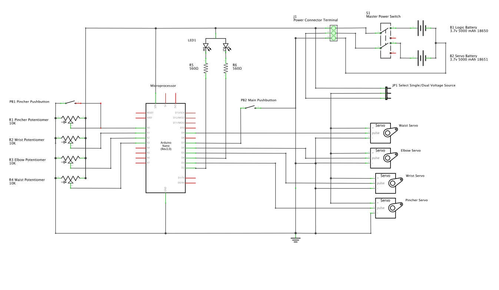

# Mimic

"Mimic" Desktop robotic arm toy project

Created January 2020 by Trent M. Wyatt

[Video link](https://www.youtube.com/watch?v=EOwqZuc2aEc)

+ Box with two arms, each with 4 degrees of freedom: Waist, Elbow, Wrist, and Pincher.
+ The first arm has a 5K or 10K potentiometer at each joint and the other arm has a servo at each joint.
+ The first arm is the input arm, reading the 4 analog values from the pots
+ The second arm is the output arm that can mimic the movements of the input arm
+ A pushbutton and a bi-color LED are provided as input and output for setup, mode selection etc.
+ An on/off switch is also included.
+ A jumper is included to allow single or dual voltage sources for logic and servos
+ Two 18650's power the logic and servos
+ Built in USB battery charger

Current features:
 + Allows the output arm to mimic the input arm in real time.
 + The mimic can be disabled
 + It can "park" the output arm so it lays flat across to box top
 + Movements can be recorded and played back
 + Recorded movements can be stored to/from EEPROM
 + Uses Button "Gestures" to multiplex the functionality of the single control button
 + During playback the "pinch" potentiometer controls the playback speed
 + Uses lightweight dynamic template based storage for recording, playback, and parking sequences
 + (hardware) Added a brace to pressure the wrist servo shaft so it stays
     pressed in (better: replace that servo)

Control by using the button with "gestures":
  + Single Click:                Toggle idle or mimic mode
  + Single Click and Hold:       Enter Recording Mode:
    + Single Click:              Add position
    + Single Click and hold:     Exit recording mode
  + Double Click:                Enter Playback Mode:
    + Any button press:          Exit playback mode
  + Double Click and Hold:       Park the servo arm and save any recording to the EEPROM

TODO:
 + Add googly eyes to servo arm :-)
 + Add ability to play "Scissors/Rock/Paper" against the arm! :-)
 + Add mic and op-amp to have dance-party mode!
 + Enhance the output arm so it takes the position of each servo into account
     when moving to a new set of positions so the deltas for each movement
     can be evenly spread across a given amount of time. This will allow
     further enhancement as a "playback speed" setting can then be added.
 + Add a SoftSerial port and implement an API to allow external control
 + Add HM-10 BlueTooth module to SoftSerial port for wireless control
 + Use the serial API to drive the arm [from my JavaChess repo](https://github.com/ripred/JavaChess)
 + Use the serial API to be able generate arm animations whe someone scores [from my nhl/baseball feeds repo](https://github.com/ripred/sportslist)

